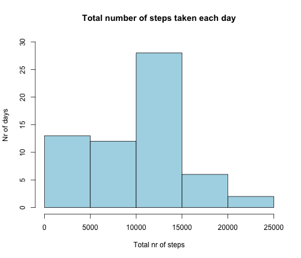
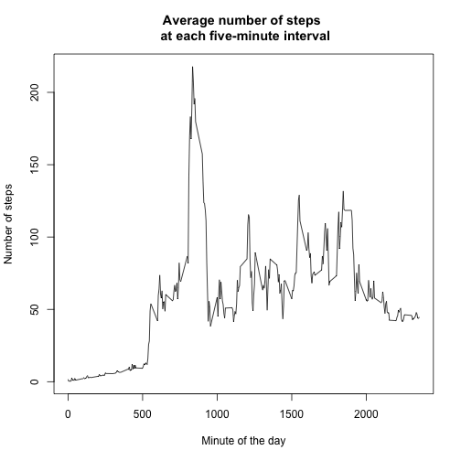
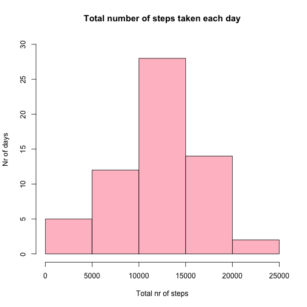
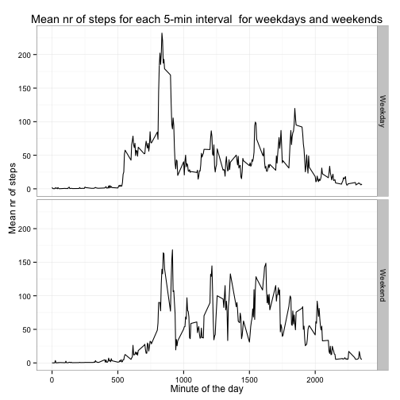

# Assignment 1 Reproducible research

## Loading and preprocessing the data

The first step of the current analysis is to read in the data, format the data to fit the analysis and to load the required r-packages. 


```r
library(plyr)
library(ggplot2)
library(reshape2)

activity <- read.csv("/Users/Sigurgeir/Desktop/coursera/reproducible_research/assignment1/activity.csv", h=T)
activity$date <- as.Date(activity$date, format = "%Y-%m-%d")

#To show the reader the format of the data:
str(activity)
```

```
## 'data.frame':	17568 obs. of  3 variables:
##  $ steps   : int  NA NA NA NA NA NA NA NA NA NA ...
##  $ date    : Date, format: "2012-10-01" "2012-10-01" ...
##  $ interval: int  0 5 10 15 20 25 30 35 40 45 ...
```

## What is mean total number of steps taken per day?

For this part of the assignment, you can ignore the missing values in the dataset.

1. Calculate the total number of steps taken per day
2. If you do not understand the difference between a histogram and a barplot, research the difference between them. Make a histogram of the total number of steps taken each day
3. Calculate and report the mean and median of the total number of steps taken per day


```r
total_nr_of_steps <- tapply(activity$steps, activity$date, sum, na.rm=T)

hist(total_nr_of_steps, xlab="Total nr of steps", ylab="Nr of days", main="Total number of steps taken each day", col="lightblue", ylim=c(0,30))
```

 

```r
mean(total_nr_of_steps)
```

```
## [1] 9354.23
```

```r
median(total_nr_of_steps)
```

```
## [1] 10395
```

## What is the average daily activity pattern?

Make a time series plot (i.e. type = "l") of the 5-minute interval (x-axis) and the average number of steps taken, averaged across all days (y-axis)

Which 5-minute interval, on average across all the days in the dataset, contains the maximum number of steps?


```r
all_dates <- split(activity$steps, activity$date)
dates <- names(all_dates)
all_dates <- do.call(cbind, all_dates)
all_dates <- data.frame(activity$interval[activity$date==unique(activity$date)[1]], all_dates)
colnames(all_dates) <- c("Interval", dates)

average_all_days <- apply(all_dates, 1, mean, na.rm=T)
plot(x=all_dates$Interval, y=average_all_days, type="l", xlab="Minute of the day", ylab="Number of steps", main="Average number of steps \n at each five-minute interval")
```

 

```r
#Find the 5-minute interval which contains the maximum number of steps on average:
lower_limit <- all_dates$Interval[which.max(average_all_days)]
higher_limit <- all_dates$Interval[which.max(average_all_days)+1]
```

The 5-minute interval that contains the maximum number of steps, averaged over all days, is minutes 835 to 840

## Imputing missing values

Note that there are a number of days/intervals where there are missing values (coded as NA). The presence of missing days may introduce bias into some calculations or summaries of the data.

1. Calculate and report the total number of missing values in the dataset (i.e. the total number of rows with NAs)
2. Devise a strategy for filling in all of the missing values in the dataset. The strategy does not need to be sophisticated. For example, you could use the mean/median for that day, or the mean for that 5-minute interval, etc.
3. Create a new dataset that is equal to the original dataset but with the missing data filled in.
4. Make a histogram of the total number of steps taken each day and Calculate and report the mean and median total number of steps taken per day. Do these values differ from the estimates from the first part of the assignment? What is the impact of imputing missing data on the estimates of the total daily number of steps?


```r
nr_of_missing_values <- sum(!complete.cases(activity))
```

The number of missing values accross the activity data is 2304.

I've chosen the imputation strategy to impute missing values based on the average number of steps for each interval in the dataset. 


```r
imputed_activity <- activity
for (i in 1:nrow(imputed_activity)) {
  if(is.na(imputed_activity$steps[i])){
    interval_nr <- which(all_dates$Interval==imputed_activity$interval[i])
    imputed_activity$steps[i] <- average_all_days[interval_nr]}
}

imputed_total_nr_of_steps <- tapply(imputed_activity$steps, imputed_activity$date, sum, na.rm=T)

hist(imputed_total_nr_of_steps, xlab="Total nr of steps", ylab="Nr of days", main="Total number of steps taken each day", col="pink", ylim=c(0,30))
```

 

```r
mean(imputed_total_nr_of_steps)
```

```
## [1] 11563.65
```

```r
median(imputed_total_nr_of_steps)
```

```
## [1] 11458
```

Clearly, the values are very different after imputation. We can see by comparing the plots above that the mean of total number of steps is normally distributed after imputation. This is what we would expect as the means of measurements for any variable always follow the normal distribution. 

We also observe that the mean and median of total number of steps pr day are both raised after imputation. 
The mean is now a lot closer to the median, which is a result of the data being more closely normally distributed. 


```r
mean(imputed_total_nr_of_steps) - mean(total_nr_of_steps)
```

```
## [1] 2209.418
```

```r
median(imputed_total_nr_of_steps) - median(total_nr_of_steps)
```

```
## [1] 1063
```

## Are there differences in activity patterns between weekdays and weekends?

For this part the weekdays() function may be of some help here. Use the dataset with the filled-in missing values for this part.

Create a new factor variable in the dataset with two levels – “weekday” and “weekend” indicating whether a given date is a weekday or weekend day.

Make a panel plot containing a time series plot (i.e. type = "l") of the 5-minute interval (x-axis) and the average number of steps taken, averaged across all weekday days or weekend days (y-axis). See the README file in the GitHub repository to see an example of what this plot should look like using simulated data.


```r
imputed_activity$day_type <- factor(imputed_activity,levels=c(1,2),labels = c("weekday","weekend"))
day_types <- weekdays(imputed_activity$date)
for( i in 1:nrow(imputed_activity)){
  if(day_types[i]=="Saturday" | day_types[i]=="Sunday"){ imputed_activity$day_type[i]<- "weekend"}
  else imputed_activity$day_type[i]<- "weekday"
}

weekday_data <- imputed_activity[imputed_activity$day_type=="weekday", ]
weekend_data <- imputed_activity[imputed_activity$day_type=="weekend", ]

weekday_means <- tapply(weekday_data$steps, weekday_data$interval, mean, na.rm=T)
weekend_means <- tapply(weekend_data$steps, weekend_data$interval, mean, na.rm=T)

for_plotting_weekday <- data.frame(all_dates$Interval, weekday_means)
for_plotting_weekday$day_type <- "Weekday"
colnames(for_plotting_weekday) <- c("Interval", "mean_steps", "day_type")
for_plotting_weekends <- data.frame(all_dates$Interval, weekend_means)
for_plotting_weekends$day_type <- "Weekend"
colnames(for_plotting_weekends) <- c("Interval", "mean_steps", "day_type")
for_plotting <- data.frame(rbind(for_plotting_weekday, for_plotting_weekends))

ggplot(for_plotting, aes(x=Interval, y=mean_steps)) + geom_line() + facet_grid(day_type~.) + labs(title="Mean nr of steps for each 5-min interval \ for weekdays and weekends", x="Minute of the day", y="Mean nr of steps") + theme_bw()
```

 
